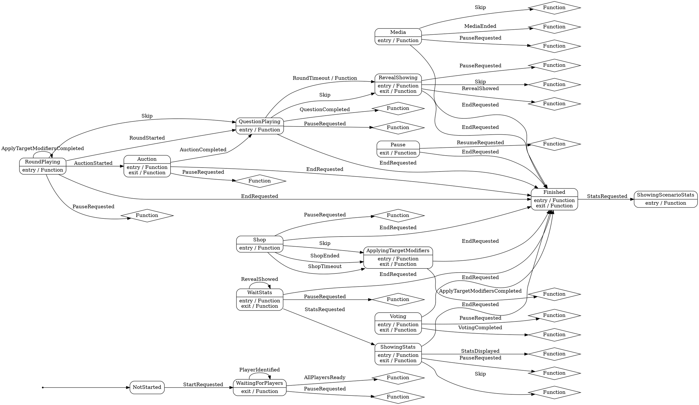

# Quizard

Для визуализации схемы переходов необходимо скопировать схему в формате .dot и визуализировать ее с помощью [WebGraphviz](http://www.webgraphviz.com/).

### Схема в формате [.mmd](fsm.mmd)
### Схема в формате .dot:
