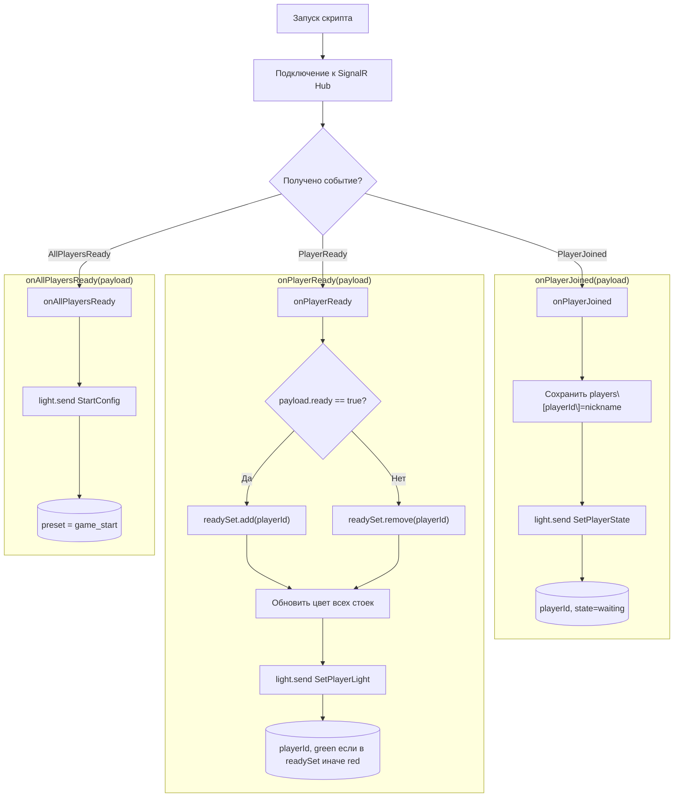

# Quizard

## Руководство по интеграции с SignalR хабом
Данное руководство предназначено для внешних разработчиков, желающих подключаться к SignalR хабу GameHub и обрабатывать события игрового процесса. Ниже описаны все доступные методы, их назначение и форматы передаваемых данных, а также пример подключения на JavaScript/python.

---

### 1. Подключение к хабу

```jsx
import * as signalR from "@microsoft/signalr";

const connection = new signalR.HubConnectionBuilder()
  .withUrl("https://{host ip}.com/gameHub")
  .withAutomaticReconnect()
  .configureLogging(signalR.LogLevel.Information)
  .build();

async function start() {
  try {
    await connection.start();
    console.log("SignalR connected");
  } catch (err) {
    console.error(err);
    setTimeout(start, 5000);
  }
}

start();
```

---

### 2. Группы клиентов

Хаб использует следующие группы для рассылки уведомлений:

- **All** — все клиенты (игроки, администратор, информатор)
- **Informer** — только клиент-информатор
- **Admin** — только клиент-администратор
- **Client** — только клиент-игрок

---

### 3. Список доступных методов и событий

| Метод (константа)            | Описание                                       | Параметры (payload)                        |
|------------------------------|------------------------------------------------|--------------------------------------------|
| `Log`                        | Логирование на стороне администратора          | `methodName: string`, `args: any[]`        |
| `Skip`                       | Пропуск текущей стадии экрана информатора      | нет                                        |
| `GamePaused`                 | Игра приостановлена                            | нет                                        |
| `GameResumed`                | Игра возобновлена                              | нет                                        |
| `ForceDisconnect`            | Завершение игры. Клиент должен отключиться     | нет                                        |
| `GameStateChanged`           | Изменение состояния игровой сессии             | `state: GameState`, `trigger: GameTrigger` |
| `PlayerHasDisconnected`      | Игрок отключился                               | `nickname: string`, `reason: string`       |
| `ClientDisconnected`         | Клиент-информатор или администратор отключился | `clientType: string`, `reason: string`     |
| `ReceivePlayerList`          | Отправка списка игроков                        | `players: string[]`                        |
| `ReceiveGameScenario`        | Отправка текущего сценария                     | `scenario: Scenario`                       |
| `ShowMedia`                  | Показ медиа файла                              | `media: Media`                             |
| `RoundStarted`               | Начало раунда                                  | `round: Round`                             |
| `QuestionStarted`            | Начало общего вопроса                          | `question: Question`                       |
| `TargetQuestionStarted`      | Начало вопроса для конкретного игрока          | `player: Player`, `question: Question`     |
| `SpeedQuestionWinner`        | Победитель скоростного раунда                  | `nickname: string`                         |
| `InteractiveQuestionResults` | Результаты интерактивного раунда               | `points: number`                           |
| `ShowReveal`                 | Показ правильного ответа                       | `reveal: Reveal`                           |
| `ShowStatistics`             | Показ статистики раунда                        | `statistic: RoundStatistic[]`              |
| `ShowScenarioStatistics`     | Показ статистики сценария                      | `statistic: ScenarioStatistic[]`           |
| `VotingStarted`              | Начало голосования за раунды                   | `roundsForVoting: Round[]`                 |
| `ShopStarted`                | Начало стадии магазина                         | `config: PurchasePhaseConfiguration`       |
| `StockUpdated`               | Обновление остатков магазина                   | `stocks: Stock[]`                          |
| `ProductIsOutOfStock`        | Товар закончился                               | `modifier: ModifierType`                   |
| `ShopResults`                | Результаты покупок                             | `results: ShopResult[]`                    |
| `ModifierApplied`            | Применен модификатор                           | `modifier: ModifierType`                   |
| `MineApplied`                | Применена мина к игроку                        | `nickname: string`                         |
| `MineExploded`               | Взрыв мины. Список пострадавших игроков        | `owner: string`, `impacted: string[]`      |
| `ShakerApplied`              | Применен эффект "перемешивания кнопок"         | `nickname: string`                         |
| `MirroredRound`              | Применен эффект "переворачивания"              | нет                                        |
| `InformerIdentified`         | Информатор идентифицирован                     | нет                                        |
| `AdminIdentified`            | Администратор идентифицирован                  | нет                                        |
| `UpdatePlayerHighlighting`   | Обновление подсветки игроков                   | `highlightedNicknames: string[]`           |
| `InitPlayerHighlighting`     | Инициализация подсветки игрока                 | `nickname: string`, `rackId: string`       |

---

### 4. Пример подписки на события

```jsx
// Обработка логов администратора
connection.on(HubMethods.Log, (methodName, args) => {
  console.log(`[LOG] ${methodName}:`, args);
});

// Обработка изменений состояния игры
connection.on(HubMethods.GameStateChanged, (state, trigger) => {
  console.log(`Game state changed to ${state}, trigger: ${trigger}`);
});

// Обработка начала раунда
connection.on(HubMethods.RoundStarted, (round) => {
  // round: { id, name, duration, ... }
  startRoundUI(round);
});

```

---

### 5. Рекомендации по обработке ошибок и восстановлению

- Используйте `connection.onclose()` для обработки разрывов соединения.
- Реализуйте `withAutomaticReconnect()` и настройте логику экспоненциальной паузы.
- Валидируйте данные событий перед использованием.

---

### 6. Отправка событий в хаб

Ниже перечислены методы хаба, которые сторонние клиенты могут вызывать (через `connection.invoke`) для управления игрой и взаимодействия с сервером.

| Метод на клиенте (HubMethods)                 | Имя метода хаба (invoke)                      | Описание                                        | Параметры (payload)                       |
|-----------------------------------------------|-----------------------------------------------|-------------------------------------------------|-------------------------------------------|
| `IdentifyPlayer`                              | `IdentifyPlayer`                              | Идентификация клиента как игрока                | `nickname: string`, `rackId: string`      |
| `IdentifyInformer`                            | `IdentifyInformer`                            | Идентификация клиента как информатора           | нет                                       |
| `IdentifyAdmin`                               | `IdentifyAdmin`                               | Идентификация клиента как администратора        | нет                                       |
| `PauseGame`                                   | `PauseGame`                                   | Приостановить игровую сессию                    | нет                                       |
| `ResumeGame`                                  | `ResumeGame`                                  | Возобновить игровую сессию                      | нет                                       |
| `SkipStage`                                   | `SkipStage`                                   | Пропустить текущий этап игрового процесса       | нет                                       |
| `StopGame`                                    | `StopGame`                                    | Принудительно завершить игру                    | нет                                       |
| `GetCurrentScenario`                          | `GetCurrentScenario`                          | Запросить текущий сценарий                      | нет                                       |
| `GetPlayerList`                               | `GetPlayerList`                               | Запросить список игроков текущей сессии         | нет                                       |
| `MediaEnded`                                  | `MediaEnded`                                  | Сообщить серверу о завершении показа медиа      | нет                                       |
| `AnswerQuestion`                              | `AnswerQuestion`                              | Отправить результат ответа на вопрос            | `isCorrect: boolean`                      |
| `FastestAnswer`                               | `FastestAnswer`                               | Отправить ответ на скоростной вопрос            | `isCorrect: boolean`, `timestamp: number` |
| `RevealShowed`                                | `RevealShowed`                                | Сообщить о показе правильного ответа            | нет                                       |
| `SendStatistics`                              | `SendStatistics`                              | Отправить результат интерактивного раунда       | `score: number`                           |
| `SendScenarioStatistics`                      | `SendScenarioStatistics`                      | Отправить результат конца сценария              | `score: number`                           |
| `StatsDisplayed`                              | `StatsDisplayed`                              | Сообщить о завершении просмотра статистики      | нет                                       |
| `PlayerMakeBet`                               | `PlayerMakeBet`                               | Сообщить о сделанной ставке в аукционе          | нет                                       |
| `SubmitPlayerVoteChoice`                      | `SubmitPlayerVoteChoice`                      | Отправить голос игрока за раунд                 | `roundId: string`, `votes: number`        |
| `PlayerMakePurchase`                          | `PlayerMakePurchase`                          | Сделать покупку в магазине                      | `modifier: ModifierType`                  |
| `PlayerHasCompletedPurchases`                 | `PlayerHasCompletedPurchases`                 | Сообщить о завершении всех покупок              | нет                                       |
| `SubmitMineModifierTarget`                    | `SubmitMineModifierTarget`                    | Применить мину к указанному игроку              | `nickname: string`                        |
| `MineExploded`                                | `MineExploded`                                | Сообщить о взрыве мины                          | нет                                       |
| `MirroredModifierProtected`                   | `MirroredModifierProtected`                   | Сообщить о сработавшей зеркальной ловушке       | нет                                       |
| `SubmitShakerModifierUsed`                    | `SubmitShakerModifierUsed`                    | Применить эффект перемешивания кнопок к игроку  | `nickname: string`                        |
| `SubmitNotTargetModifier`                     | `SubmitNotTargetModifier`                     | Применить модификатор (например, общий эффект)  | `modifier: ModifierType`                  |
| `PlayerHasCompletedApplicationTargetModifier` | `PlayerHasCompletedApplicationTargetModifier` | Сообщить о завершении применения модификаторов  | нет                                       |

#### Пример вызова метода

```jsx
// Идентифицировать игрока
connection.invoke(HubMethods.IdentifyPlayer, "player1", "rackA")
  .then(() => console.log("Игрок идентифицирован"))
  .catch(err => console.error(err));

// Отправить ответ на вопрос
connection.invoke(HubMethods.AnswerQuestion, true)
  .catch(err => console.error(err));
```

#### AsyncAPI

В проекте находится файл [GameHub.yaml](GameHub.yaml), который можно визуализировать с помощью AsyncAPI Studio

---

### 7. Дополнительные ресурсы

- [Документация SignalR (Microsoft)](https://docs.microsoft.com/aspnet/core/signalr)
- Исходный код хаба доступен в проекте [Quizard SignalR](Quizard.SignalR)

---

### 8. (Example) Абстрактный пример Light Controller
1. Как подключаться к SignalR‑хабу
2. Как ловить события PlayerJoined, PlayerReady, AllPlayersReady
3. Как хранить локальное состояние игроков
4. Как отдавать команды на свет (в примере через абстрактный light_controller.send(...))

#### Пример реализации (Python + абстракции)
```python
# pip install signalrcore
from signalrcore.hub_connection_builder import HubConnectionBuilder
import threading
import time

# Абстрактный клиент
class LightControllerClient:
    def __init__(self, endpoint):
        # endpoint — адрес контроллера
        self.endpoint = endpoint

    def send(self, command_type: str, parameters: dict):
        # Здесь будет HTTP-запрос, TCP, serial и т.п.
        print(f"[LIGHT] {command_type}: {parameters}")

# Основной класс, который держит состояние и хендлит события
class QuizLightConnector:
    def __init__(self, hub_url, hub_name, light_endpoint):
        self.players = {}          # player_id → nickname
        self.ready = set()        # player_id, которые нажали Ready
        self.hub = (HubConnectionBuilder()
                    .with_url(hub_url)
                    .build())
        self.light = LightControllerClient(light_endpoint)
        self._register_handlers()

    def _register_handlers(self):
        self.hub.on("PlayerJoined", self.on_player_joined)
        self.hub.on("PlayerReady", self.on_player_ready)
        self.hub.on("AllPlayersReady", self.on_all_players_ready)

    def start(self):
        self.hub.start()
        print("Connected to SignalR Hub, listening for events...")

    def on_player_joined(self, args):
        payload = args[0]
        pid = payload["playerId"]
        nick = payload["nickname"]
        self.players[pid] = nick
        # Сразу переключаем стойку игрока в «ожидание»
        self.light.send("SetPlayerState", {
            "playerId": pid,
            "state": "waiting"
        })
        print(f"PlayerJoined: {nick} ({pid})")

    def on_player_ready(self, args):
        payload = args[0]
        pid = payload["playerId"]
        ready_flag = payload.get("ready", True)
        if ready_flag:
            self.ready.add(pid)
            state = "ready"
        else:
            self.ready.discard(pid)
            state = "waiting"
        # Подсветка: готовым — зелёный, остальным — красный
        for p in self.players:
            self.light.send("SetPlayerLight", {
                "playerId": p,
                "color": "green" if p in self.ready else "red"
            })
        print(f"PlayerReady: {pid} → {state}")

    def on_all_players_ready(self, args):
        payload = args[0]
        pids = payload["players"]
        # Все готовы — общий эффект, например, «старт»
        self.light.send("StartConfig", { "preset": "game_start" })
        print("AllPlayersReady: triggering start lights")

# Точка входа
if __name__ == "__main__":
    connector = QuizLightConnector(
        hub_url="https://yourserver.com/quizhub",
        hub_name="QuizHub",
        light_endpoint="http://light-controller.local/api"
    )
    connector.start()

    # Чтобы скрипт жил, пока хаб не закроется
    try:
        while True:
            time.sleep(1)
    except KeyboardInterrupt:
        print("Stopping...")
        connector.hub.stop()

```

#### Блок‑схема логики


#### Пояснения к узлам
1. **A → B**

   Запускаем Python-скрипт и устанавливаем соединение с вашим SignalR‑хабом (`HubConnectionBuilder().with_url(...).build()`).

2. **C — ветвление по `event`**

   В зависимости от поступившего названия события вызывается соответствующий метод‑обработчик.

3. **onPlayerJoined**
    - Обновляем локальный словарь `players[playerId] = nickname`.
    - Отправляем команду для подсветки:

        ```python
        light.send("SetPlayerState", {
            "playerId": pid,
            "state": "waiting"
        })
        ```

4. **onPlayerReady**
    - Если `payload.ready == true` — добавляем `playerId` в `readySet`, иначе — удаляем из множества.
    - Проходим по всем `playerId` в `players`: для каждого шлём

        ```python
        light.send("SetPlayerLight", {
            "playerId": p,
            "color": "green" if p in readySet else "red"
        })
        ```

5. **onAllPlayersReady**
    - Все подтвердили готовность — запускаем «стартовую» световую конфигурацию:

        ```python
        light.send("StartConfig", {
            "preset": "game_start"
        })
        ```

#### Пояснения

- **HubConnectionBuilder**: стандартный клиент для SignalR в Python (пакет `signalrcore`), подписывается на события хаба.
- **self.hub.on("EventName", handler)**: регистрирует колбэк, который получит список аргументов, первым из которых всегда — `payload`.
- **LightControllerClient.send**: абстракция отправки команды на физический контроллер света. Здесь вы можете реализовать HTTP-запрос или низкоуровневый протокол.
- **Внутреннее состояние (`self.players`, `self.ready`)** нужно, чтобы принимать решения о цвете каждой стойки.